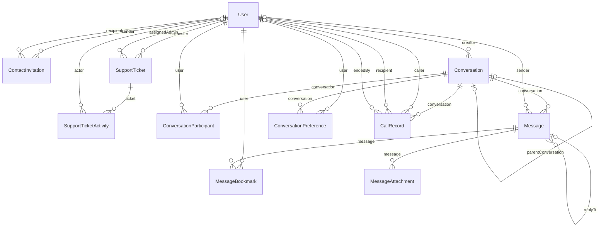

# ElloDB Güncel Veri Modeli

Güncelleme tarihi: 27.07.2026

Kaynak: `backend/prisma/schema.prisma`

> Bu dosya `scripts/generate-database-model-report.py` tarafından üretilir. Şema değiştiğinde betiği yeniden çalıştırın.

## Genel Bakış

ellO, PostgreSQL üzerinde Prisma ORM kullanan gerçek zamanlı bir mesajlaşma uygulamasıdır. Güncel şema kullanıcı, iletişim daveti, destek talebi, direkt/grup/yönetim sohbeti, mesaj, reply, bookmark, kişisel sohbet tercihi, çağrı geçmişi ve kalıcı mesaj eki akışlarını kapsar.

- 11 fiziksel tablo
- 10 enum
- 22 açık foreign-key ilişkisi
- UUID tabanlı anahtarlar ve PostgreSQL
- Mesaj retry idempotency, soft delete ve kullanıcıya özel tercihler

## Model Envanteri

| Prisma modeli | PostgreSQL tablosu | Fiziksel alan | Açıklama |
| --- | --- | ---: | --- |
| `User` | `users` | 11 | Kimlik doğrulama, rol, profil ve kullanıcıya bağlı tüm iş kayıtlarının merkezidir. |
| `ContactInvitation` | `contact_invitations` | 8 | Kullanıcılar arasındaki bekleyen, kabul edilen veya reddedilen iletişim davetlerini tutar. |
| `SupportTicket` | `support_tickets` | 12 | Kullanıcının açtığı destek talebini, atanan admini, önceliği ve yaşam döngüsünü saklar. |
| `SupportTicketActivity` | `support_ticket_activities` | 7 | Destek taleplerindeki atama, durum ve öncelik değişikliklerinin denetim geçmişidir. |
| `Conversation` | `conversations` | 14 | Direkt, grup ve yalnızca yöneticilere açık yönetim sohbetlerini tek yapıda temsil eder. |
| `ConversationParticipant` | `conversation_participants` | 6 | Kullanıcı ile sohbet arasındaki üyelik, rol, okuma ve ayrılma durumunu tutar. |
| `Message` | `messages` | 11 | Mesaj içeriğini, reply bağını, forward bilgisini ve yumuşak silme durumunu saklar. |
| `MessageBookmark` | `message_bookmarks` | 5 | Bir kullanıcının belirli bir mesajı kişisel olarak kaydetmesini sağlar. |
| `ConversationPreference` | `conversation_preferences` | 7 | Kullanıcıya özel sohbet kaydetme, arşivleme ve gizleme tercihlerini tutar. |
| `CallRecord` | `call_records` | 10 | Birebir sesli aramaların arayan, alıcı, durum ve zaman bilgisini kaydeder. |
| `MessageAttachment` | `message_attachments` | 7 | Mesaj eklerinin dosya adı, MIME türü, boyutu ve ikili verisini PostgreSQL'de saklar. |

## Ayrıntılı Modeller

### User (`users`)

Kimlik doğrulama, rol, profil ve kullanıcıya bağlı tüm iş kayıtlarının merkezidir.

| Alan | Tür | Kural |
| --- | --- | --- |
| `id` | `String` | PK, Not null, Default: uuid(), Uuid |
| `automationId` | `Int?` | Unique, Nullable |
| `email` | `String` | Unique, Not null |
| `username` | `String` | Unique, Not null |
| `passwordHash` | `String` | Not null |
| `role` | `UserRole` | Not null, Default: user |
| `about` | `String?` | Nullable |
| `location` | `String?` | Nullable |
| `profileImage` | `String?` | Nullable, Text |
| `createdAt` | `DateTime` | Not null, Default: now() |
| `updatedAt` | `DateTime` | Not null, Otomatik güncellenir |

Model kuralları: `index([role])`

### ContactInvitation (`contact_invitations`)

Kullanıcılar arasındaki bekleyen, kabul edilen veya reddedilen iletişim davetlerini tutar.

| Alan | Tür | Kural |
| --- | --- | --- |
| `id` | `String` | PK, Not null, Default: uuid(), Uuid |
| `senderId` | `String` | Not null, Uuid |
| `recipientId` | `String` | Not null, Uuid |
| `message` | `String?` | Nullable |
| `status` | `ContactInvitationStatus` | Not null, Default: pending |
| `createdAt` | `DateTime` | Not null, Default: now() |
| `updatedAt` | `DateTime` | Not null, Otomatik güncellenir |
| `respondedAt` | `DateTime?` | Nullable |

Model kuralları: `index([recipientId, status, createdAt])`, `index([senderId, status, createdAt])`

### SupportTicket (`support_tickets`)

Kullanıcının açtığı destek talebini, atanan admini, önceliği ve yaşam döngüsünü saklar.

| Alan | Tür | Kural |
| --- | --- | --- |
| `id` | `String` | PK, Not null, Default: uuid(), Uuid |
| `requesterId` | `String` | Not null, Uuid |
| `assignedAdminId` | `String?` | Nullable, Uuid |
| `subject` | `String` | Not null |
| `message` | `String` | Not null, Text |
| `priority` | `SupportTicketPriority` | Not null, Default: medium |
| `status` | `SupportTicketStatus` | Not null, Default: open |
| `adminNote` | `String?` | Nullable, Text |
| `version` | `Int` | Not null, Default: 1 |
| `createdAt` | `DateTime` | Not null, Default: now() |
| `updatedAt` | `DateTime` | Not null, Otomatik güncellenir |
| `resolvedAt` | `DateTime?` | Nullable |

Model kuralları: `index([requesterId, createdAt])`, `index([assignedAdminId, status])`, `index([status, priority])`

### SupportTicketActivity (`support_ticket_activities`)

Destek taleplerindeki atama, durum ve öncelik değişikliklerinin denetim geçmişidir.

| Alan | Tür | Kural |
| --- | --- | --- |
| `id` | `String` | PK, Not null, Default: uuid(), Uuid |
| `ticketId` | `String` | Not null, Uuid |
| `actorId` | `String?` | Nullable, Uuid |
| `action` | `SupportTicketActivityAction` | Not null |
| `fromValue` | `String?` | Nullable |
| `toValue` | `String?` | Nullable |
| `createdAt` | `DateTime` | Not null, Default: now() |

Model kuralları: `index([ticketId, createdAt])`, `index([actorId])`

### Conversation (`conversations`)

Direkt, grup ve yalnızca yöneticilere açık yönetim sohbetlerini tek yapıda temsil eder.

| Alan | Tür | Kural |
| --- | --- | --- |
| `id` | `String` | PK, Not null, Default: uuid(), Uuid |
| `type` | `ConversationType` | Not null |
| `name` | `String?` | Nullable |
| `description` | `String?` | Nullable |
| `createdBy` | `String` | Not null, Uuid |
| `externalRef` | `String?` | Unique, Nullable |
| `isBotManaged` | `Boolean` | Not null, Default: false |
| `sourceName` | `String?` | Nullable |
| `memberCanSendMessages` | `Boolean` | Not null, Default: false |
| `membersCanLeave` | `Boolean` | Not null, Default: true |
| `status` | `ConversationStatus` | Not null, Default: active |
| `parentConversationId` | `String?` | Unique, Nullable, Uuid |
| `createdAt` | `DateTime` | Not null, Default: now() |
| `updatedAt` | `DateTime` | Not null, Otomatik güncellenir |

Model kuralları: `index([type])`, `index([createdBy])`, `index([status])`, `index([updatedAt])`

### ConversationParticipant (`conversation_participants`)

Kullanıcı ile sohbet arasındaki üyelik, rol, okuma ve ayrılma durumunu tutar.

| Alan | Tür | Kural |
| --- | --- | --- |
| `conversationId` | `String` | Not null, Uuid |
| `userId` | `String` | Not null, Uuid |
| `role` | `ParticipantRole` | Not null, Default: member |
| `joinedAt` | `DateTime` | Not null, Default: now() |
| `lastReadAt` | `DateTime?` | Nullable |
| `leftAt` | `DateTime?` | Nullable |

Model kuralları: `id([conversationId, userId])`, `index([userId])`, `index([role])`, `index([leftAt])`

### Message (`messages`)

Mesaj içeriğini, reply bağını, forward bilgisini ve yumuşak silme durumunu saklar.

| Alan | Tür | Kural |
| --- | --- | --- |
| `id` | `String` | PK, Not null, Default: uuid(), Uuid |
| `clientMessageId` | `String?` | Nullable, Uuid |
| `conversationId` | `String` | Not null, Uuid |
| `senderId` | `String?` | Nullable, Uuid |
| `replyToMessageId` | `String?` | Nullable, Uuid |
| `content` | `String` | Not null |
| `messageType` | `MessageType` | Not null, Default: user |
| `isForwarded` | `Boolean` | Not null, Default: false |
| `createdAt` | `DateTime` | Not null, Default: now() |
| `updatedAt` | `DateTime?` | Nullable |
| `deletedAt` | `DateTime?` | Nullable |

Model kuralları: `unique([senderId, clientMessageId])`, `index([conversationId, createdAt])`, `index([senderId])`, `index([replyToMessageId])`, `index([messageType])`, `index([deletedAt])`

### MessageBookmark (`message_bookmarks`)

Bir kullanıcının belirli bir mesajı kişisel olarak kaydetmesini sağlar.

| Alan | Tür | Kural |
| --- | --- | --- |
| `userId` | `String` | Not null, Uuid |
| `messageId` | `String` | Not null, Uuid |
| `title` | `String?` | Nullable |
| `createdAt` | `DateTime` | Not null, Default: now() |
| `updatedAt` | `DateTime` | Not null, Otomatik güncellenir |

Model kuralları: `id([userId, messageId])`, `index([userId, createdAt])`, `index([messageId])`

### ConversationPreference (`conversation_preferences`)

Kullanıcıya özel sohbet kaydetme, arşivleme ve gizleme tercihlerini tutar.

| Alan | Tür | Kural |
| --- | --- | --- |
| `userId` | `String` | Not null, Uuid |
| `conversationId` | `String` | Not null, Uuid |
| `isBookmarked` | `Boolean` | Not null, Default: false |
| `isArchived` | `Boolean` | Not null, Default: false |
| `isDeleted` | `Boolean` | Not null, Default: false |
| `createdAt` | `DateTime` | Not null, Default: now() |
| `updatedAt` | `DateTime` | Not null, Otomatik güncellenir |

Model kuralları: `id([userId, conversationId])`, `index([userId, isBookmarked])`, `index([userId, isArchived])`, `index([userId, isDeleted])`

### CallRecord (`call_records`)

Birebir sesli aramaların arayan, alıcı, durum ve zaman bilgisini kaydeder.

| Alan | Tür | Kural |
| --- | --- | --- |
| `id` | `String` | PK, Not null, Uuid |
| `conversationId` | `String` | Not null, Uuid |
| `callerId` | `String` | Not null, Uuid |
| `recipientId` | `String` | Not null, Uuid |
| `status` | `CallStatus` | Not null, Default: ringing |
| `startedAt` | `DateTime` | Not null, Default: now() |
| `answeredAt` | `DateTime?` | Nullable |
| `endedAt` | `DateTime?` | Nullable |
| `endedReason` | `String?` | Nullable |
| `endedById` | `String?` | Nullable, Uuid |

Model kuralları: `index([callerId, startedAt])`, `index([recipientId, startedAt])`, `index([conversationId, startedAt])`, `index([status])`

### MessageAttachment (`message_attachments`)

Mesaj eklerinin dosya adı, MIME türü, boyutu ve ikili verisini PostgreSQL'de saklar.

| Alan | Tür | Kural |
| --- | --- | --- |
| `id` | `String` | PK, Not null, Default: uuid(), Uuid |
| `messageId` | `String` | Not null, Uuid |
| `fileName` | `String` | Not null |
| `mimeType` | `String` | Not null |
| `fileSize` | `Int` | Not null |
| `data` | `Bytes` | Not null |
| `createdAt` | `DateTime` | Not null, Default: now() |

Model kuralları: `index([messageId])`

## ER Diyagramı



## İlişki Özeti

| Kaynak | Hedef | FK alanı | Kardinalite | Silme davranışı |
| --- | --- | --- | --- | --- |
| `ContactInvitation` | `User` | `senderId` | N -> 1 | `Cascade` |
| `ContactInvitation` | `User` | `recipientId` | N -> 1 | `Cascade` |
| `SupportTicket` | `User` | `requesterId` | N -> 1 | `Cascade` |
| `SupportTicket` | `User` | `assignedAdminId` | N -> 0..1 | `SetNull` |
| `SupportTicketActivity` | `SupportTicket` | `ticketId` | N -> 1 | `Cascade` |
| `SupportTicketActivity` | `User` | `actorId` | N -> 0..1 | `SetNull` |
| `Conversation` | `User` | `createdBy` | N -> 1 | `Restrict` |
| `Conversation` | `Conversation` | `parentConversationId` | 0..1 -> 1 | `Cascade` |
| `ConversationParticipant` | `Conversation` | `conversationId` | N -> 1 | `Cascade` |
| `ConversationParticipant` | `User` | `userId` | N -> 1 | `Cascade` |
| `Message` | `Conversation` | `conversationId` | N -> 1 | `Cascade` |
| `Message` | `User` | `senderId` | N -> 0..1 | `SetNull` |
| `Message` | `Message` | `replyToMessageId` | N -> 0..1 | `SetNull` |
| `MessageBookmark` | `User` | `userId` | N -> 1 | `Cascade` |
| `MessageBookmark` | `Message` | `messageId` | N -> 1 | `Cascade` |
| `ConversationPreference` | `User` | `userId` | N -> 1 | `Cascade` |
| `ConversationPreference` | `Conversation` | `conversationId` | N -> 1 | `Cascade` |
| `CallRecord` | `Conversation` | `conversationId` | N -> 1 | `Cascade` |
| `CallRecord` | `User` | `callerId` | N -> 1 | `Cascade` |
| `CallRecord` | `User` | `recipientId` | N -> 1 | `Cascade` |
| `CallRecord` | `User` | `endedById` | N -> 0..1 | `SetNull` |
| `MessageAttachment` | `Message` | `messageId` | N -> 1 | `Cascade` |

## Enumlar

- `UserRole`: `admin`, `user`
- `ConversationType`: `direct`, `group`, `management`
- `ParticipantRole`: `owner`, `manager`, `member`
- `ConversationStatus`: `active`, `closed`, `archived`
- `MessageType`: `user`, `system`
- `ContactInvitationStatus`: `pending`, `accepted`, `declined`
- `CallStatus`: `ringing`, `active`, `completed`, `missed`, `declined`, `failed`
- `SupportTicketPriority`: `low`, `medium`, `high`
- `SupportTicketStatus`: `open`, `in_progress`, `resolved`, `closed`
- `SupportTicketActivityAction`: `created`, `assigned`, `unassigned`, `transferred`, `status_changed`, `priority_changed`, `note_updated`

## Veri Bütünlüğü ve Tasarım Notları

- `users.email`, `users.username` ve isteğe bağlı `automationId` tekildir.
- `conversations.externalRef` dış otomasyon çağrılarında idempotency sağlar. Farklı externalRef değerleriyle birden fazla BOT grubu oluşturulabilir.
- `conversations.parentConversationId` bir grup için en fazla bir gizli yönetim sohbeti olmasını sağlar.
- `conversation_participants` birleşik anahtarı aynı kullanıcıyı aynı sohbete iki kez eklemeyi engeller.
- `messages(senderId, clientMessageId)` benzersizliği retry sırasında aynı mesajın iki kez yazılmasını engeller.
- Okundu bilgisi ayrı MessageStatus tablosu yerine katılımcının `lastReadAt` alanıyla izlenir.
- Mesaj reply ilişkisi `replyToMessageId` self-reference alanıyla korunur.
- Dosyalar yalnızca URL olarak değil, `MessageAttachment.data` alanında `Bytes` olarak kalıcı saklanır.
- Eski SQL Server raporundaki grup oluşturma trigger'ı güncel Prisma şemasında yoktur; yetkilendirme uygulama katmanındadır.
- Direkt sohbet çifti için database-level unique pair key yoktur; tekilleştirme servis katmanında yapılır.

## Doğrulama

```powershell
cd backend
npm.cmd run prisma:validate
npm.cmd run db:audit
```
